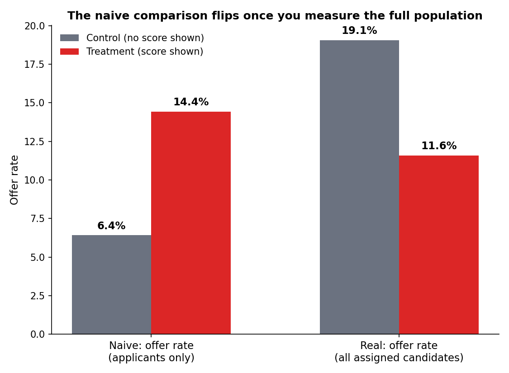

# Does Showing Candidates Their AI Match Score Actually Help Them?

[](LICENSE) [](https://github.com/EstherKim97/Hiring-Platform/actions/workflows/ci.yml)

I've applied to over 1,000 jobs and barely heard back from any of them. Like
a lot of people doing that, I got very familiar with the AI "match score"
badges these platforms put on every posting — LinkedIn Premium has one, and
a few other job sites do too. At first I trusted it: a high score gave me
hope, and I'd prioritize applying there. But the more applications I sent
out, the less the score seemed to line up with reality. High scores on
postings where I clearly didn't meet the core requirements, low scores on
ones where my background was honestly a solid fit.

Part of that, I think, is that I'm transitioning careers to become more
well-rounded, and that doesn't always read well to an algorithm — it tends
to get scored like I'm "changing careers" rather than "expanding" them.
That's a narrower version of a bigger pattern: these scores are trained on
what a "typical" candidate for a role looks like, and anyone who doesn't
fit that mold cleanly is going to get penalized by the score regardless of
whether they're actually a good fit.

That's what got me curious enough to actually test it instead of just being
annoyed by it: does showing people a match score help them apply smarter,
or does it do more harm than good — especially for candidates who don't fit
the mold? I built an A/B test to find out, using real hiring data instead of
my own anecdotal frustration. The answer surprised me — it makes hiring
outcomes *worse*, not better, and it hits non-traditional candidates hardest
of all. This repo is that experiment, and a walkthrough of how a naive read
of the results would have gotten the conclusion backwards.



## The short version

Candidates who saw their match score before applying ended up significantly
*less* likely to land any offer at all — 11.6% vs. 19.1% in the group that
didn't see a score. Looking only at people who actually applied, it appears
the opposite happened: offer rate went up, from 6.4% to 14.4%. That
comparison is misleading — seeing the score changes who bothers to apply in
the first place, so you're no longer comparing the same group of people.
The apparent "improvement" is an illusion caused by who dropped out.

Once you control for that (using CUPED, a variance-reduction technique from
Microsoft's experimentation team), the quality improvement basically
vanishes. What's actually happening: a mediocre score scares people off —
applications dropped 70% in the group that saw their score — and that
volume loss costs more than any quality gain from the people who stuck
around. It also lands unevenly: candidates with less traditional
backgrounds were discouraged from applying even more than everyone else, so
on top of the overall harm, it's arguably making the process less fair too.

**Full write-up:** [`REPORT.md`](REPORT.md)

## Why I built it this way

Most A/B testing portfolio projects stop at "I ran a t-test and got a
p-value." I wanted this one to reflect the mistake that actually trips up
data scientists in practice: measuring the wrong population. The naive
metric said ship it. The real metric said don't. Catching that gap, and
being able to explain why it happens, is the point of this project — not
the t-test itself.

## What's real and what I had to simulate

The candidate resumes, job postings, and match scores are real — over
150,000 actual application records, with match scores from genuine text
similarity between candidate skills and job requirements. What I couldn't
get real data for is how someone actually reacts to *seeing* their match
score before applying — no public dataset captures that, since it would
require a live product experiment only the platform itself could run. I
simulated that one piece and documented exactly how in
`src/simulate_behavior.py`, rather than leaving it unstated.

## Methods used

| Technique | What it's for |
|---|---|
| Randomized experiment design | Candidate-level randomization, SRM checks |
| Power analysis | Sample size before running anything |
| CUPED (Deng et al. 2013) | Variance reduction — this is what caught the selection bias |
| Always-valid sequential testing (Johari et al.) | Peeking-safe continuous monitoring |
| Causal forest CATE (Wager & Athey) | Individual-level heterogeneous treatment effects |
| Full-population analysis | The de-biased answer to the actual question I cared about |

## What this changed for me

Going in, I expected to confirm what I already suspected — that match
scores are noisy and occasionally wrong. What I didn't expect was that the
naive analysis would say the opposite of the truth, and that I'd need
something like CUPED to even see that. It's one thing to be annoyed at a
platform's UX from the outside; it's another to build the experiment
yourself and watch a "the score is helping!" result flip into "the score is
actively pushing people out" once you account for who stopped applying.
That gap — between what a surface-level metric tells you and what's
actually happening — is the same gap I ran into as a candidate, just from
the other side of the platform.

## Repo structure

```
src/                   pipeline code (run in order: load_data -> match_score
                        -> run_experiment -> analyze -> charts)
REPORT.md              full write-up with methodology and results
docs/figures/          charts generated by the pipeline
data/                  (not included — see data/README.md for dataset
                        sources and setup instructions)
```

## Reproducing this

```bash
python3 -m venv venv
source venv/bin/activate
pip install -r requirements.txt        # core dependencies
pip install -r requirements-optional.txt  # optional: econml for real per-candidate HTE

python3 src/load_data.py
python3 src/match_score.py
python3 src/run_experiment.py
python3 src/analyze.py
python3 src/charts.py
```

`data/README.md` has the real dataset sources and setup instructions.

## License

MIT — see [`LICENSE`](LICENSE).
