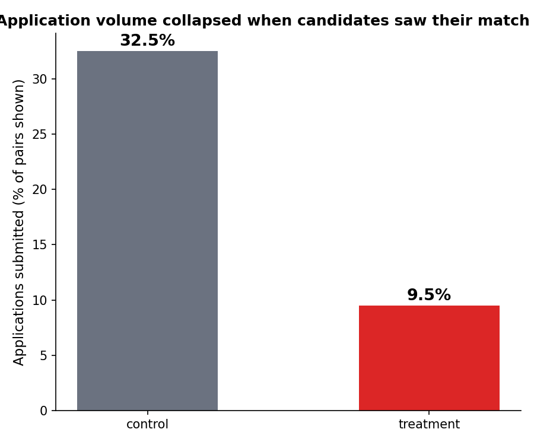
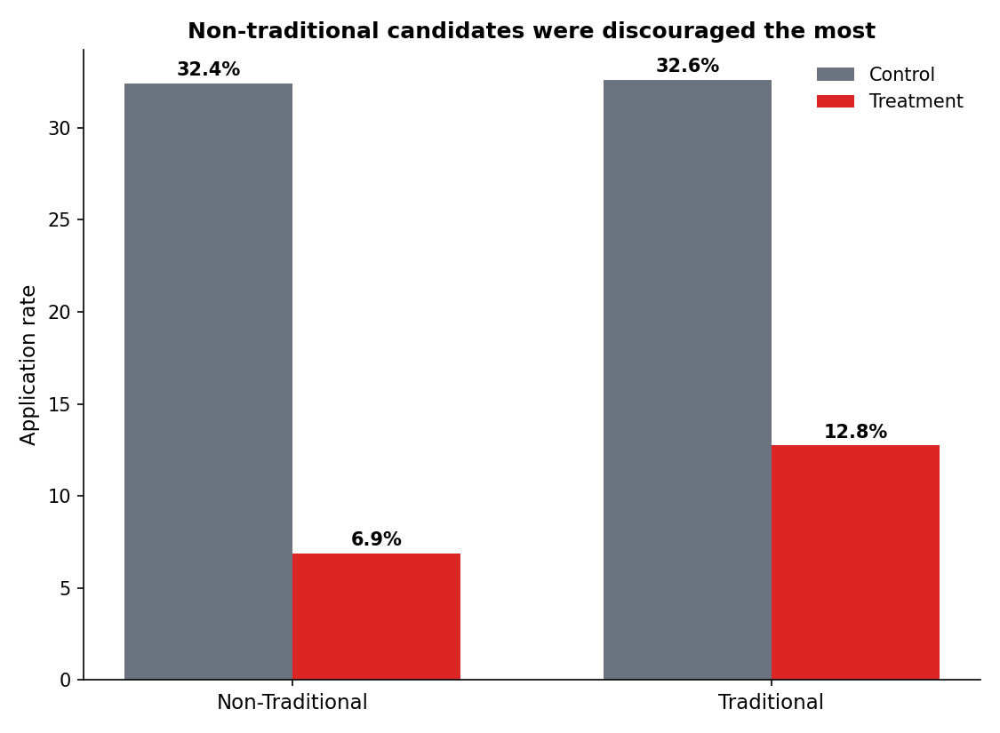

# Does Showing Candidates Their AI Match Score Actually Help Them?

## Why I looked into this

I've been job hunting recently, and like a lot of people, I kept running into AI "match score" badges on job postings — LinkedIn Premium shows one on almost every listing, and a few other sites do too. At first, I trusted it. A high score gave me hope and made me prioritize applying there. But the more jobs I applied to and the more carefully I read the descriptions, the less the score seemed to align with reality. I'd see a high match score on postings where I clearly didn't meet the core requirements, and a low score on ones where my experience actually looked like a solid fit.
That disconnect is what got me curious enough to actually dig into it properly instead of just complaining about it: does showing candidates a match score help them make better decisions, or does it end up doing more harm than good? I built a randomized experiment on real hiring data to find out. The answer surprised me — it makes hiring outcomes worse, not better — and the way I found that out is honestly the more interesting part of this project.

## What I found, in short
Candidates who saw their match score before applying were significantly less likely to receive an offer — 11.6%, compared to 19.1% for candidates who never saw a score. That's a real, meaningful drop.

If you only look at the people who actually applied, though, it looks like the opposite happened — offer rate goes up, from 6.4% to 14.4%. My first instinct was that this looked like a clean win. It isn't. The problem is that seeing the score changes who applies in the first place, so "offer rate among applicants" no longer compares the same group of people across the two conditions. Once I controlled for that using CUPED (a variance-reduction technique developed by Microsoft's own experimentation team), the "improvement" disappeared almost entirely.

What's actually going on: seeing a mediocre score scares people off. Applications dropped 70% in the group that saw their score, and that drop costs more, in terms of actual offers landed, than any quality benefit from the people who stuck around and applied anyway. It also wasn't even. Candidates from less traditional backgrounds were discouraged from applying as much as everyone else, so, on top of hurting overall outcomes, it was arguably making the process less fair, too.

## The business question

On an AI-matching hiring platform, candidates normally apply blind — they never see how well the algorithm thinks they fit a role. Would showing them that score before they apply actually help?

## How I set it up

I used real candidate resumes and real job postings — over 150,000 actual application records — to compute genuine match scores between people and roles, using text similarity between listed skills and job requirements. Nothing about the match score itself is made up.

What I couldn't get reliable data on is how someone actually behaves once they see their score — no public dataset captures that, because it would require a live product experiment that only the platform's company could run. So I simulated that one piece, and tried to be upfront about how, rather than quietly burying the assumption (it's all documented in src/simulate_behavior.py if you want the details).

I randomized at the candidate level — one person seeing their score doesn't affect anyone else's decision, so there's no interference problem to worry about there. I tracked the obvious metric (offer rate among people who applied), as well as two guardrails: total application volume and whether the effect landed evenly across different candidate backgrounds.

## Why the naive number is wrong

Looking only at submitted applications:
Control: 6.42% offer rate
Treatment: 14.44% offer rate
p < 0.0001 — on its face, this looks like a clear win

But this comparison is comparing two different populations, not measuring the treatment's actual effect. Who applies changes because of the treatment itself, so you can't just compare outcomes among the people who happened to apply in each group. I used CUPED — using match_score itself as a pre-treatment covariate — to correct for this, and the result flips: p = 0.37, not significant. The entire apparent lift is explained by people self-selecting into better-matched jobs, not by any real improvement in the hiring process.

## The real result

To get an honest answer, I measured every candidate assigned to the experiment, whether they applied or not — treating a non-applicant as a zero, not as missing data. That's the number that actually answers the question I cared about.
Control: 19.07% of candidates landed at least one offer

Treatment: 11.58% landed at least one offer
Difference: -7.5 points, p < 0.0001 — significant, and in the wrong direction

Seeing the score didn't make people apply smarter overall. Mostly, it just made them apply less, and that cost more than it gained.

## Guardrails

## Assumptions & Limitations

- CUPED relies on having a valid pre-treatment covariate that is predictive of the outcome and is not affected by treatment. Using match_score as the CUPED covariate is defensible here but should be discussed when applying to a new dataset.
- The causal-forest HTE estimates assume unconfoundedness conditional on the supplied covariates; interpreting individual-level CATEs as causal requires these covariates to capture all important confounders.
- The simulated user behavior (how candidates react when shown a score) is modelled and not observed; results should be viewed as sensitivity analyses rather than exact forecasts.
- Heavy-model results (econml causal forests) are not run in CI by default; reproduce full HTE locally by installing requirements-optional.txt.

Application volume dropped 70.6% (from 32.5% of shown job pairs down to 9.5%). Even on its own, a drop that large should stop a rollout — before you even get to whether the primary metric moved.

The effect also wasn't even across candidates. People with less traditional educational backgrounds were discouraged more than others (-78.7% application rate vs. -60.9%). I also ran a causal forest (a method from Wager & Athey that estimates each candidate's treatment effect using all their covariates simultaneously, rather than testing one segment at a time). It found that 94% of candidates have an estimated individual effect of less than -5 points on their likelihood of applying. This treatment hurts almost everyone's odds of applying, and non-traditional candidates get hit hardest.

## What I'd recommend

Don't show candidates their match score, at least not like this. In this test, it made hiring outcomes worse, and hurt non-traditional candidates the most. If a company wanted to try this idea again, I'd want to test a gentler version — like giving context around a low score instead of just showing a bare number.

One caveat: I couldn't get real data on how candidates actually react to seeing a score, since that only exists inside a live platform. So I built a model of that reaction myself and tested against it. The match scores are real; how people respond to seeing them is my best guess, not observed fact. To really trust this, someone would need to run the actual experiment on a real platform.

## Methods, for anyone curious about the technical side

- **CUPED** (Deng et al., 2013) — a variance-reduction technique using a
  pre-treatment covariate. This is what caught the selection bias problem.
- **Always-valid sequential testing** (Johari et al., 2015/2022) — lets
  you monitor results continuously without inflating false positives from
  peeking. Worth noting: this corrects for a different kind of bias than
  CUPED does — it agreed with the naive z-test here because both were
  looking at the same (biased) applicants-only comparison.
- **Causal forest CATE** (Wager & Athey) — individual-level treatment
  effect estimation, used for the equity analysis.
- **Full-population analysis** — the metric that actually answers the
  real question, without conditioning on a sample that the treatment
  itself changed.

Full code is set up to run end to end on the real data if you want to reproduce any of this.
